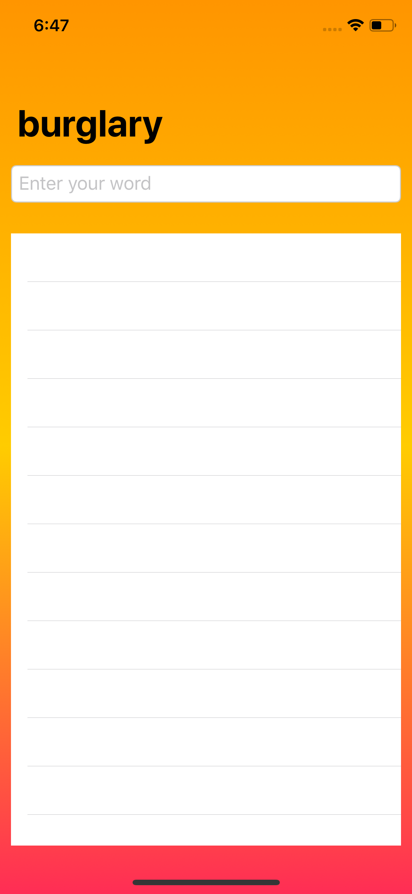
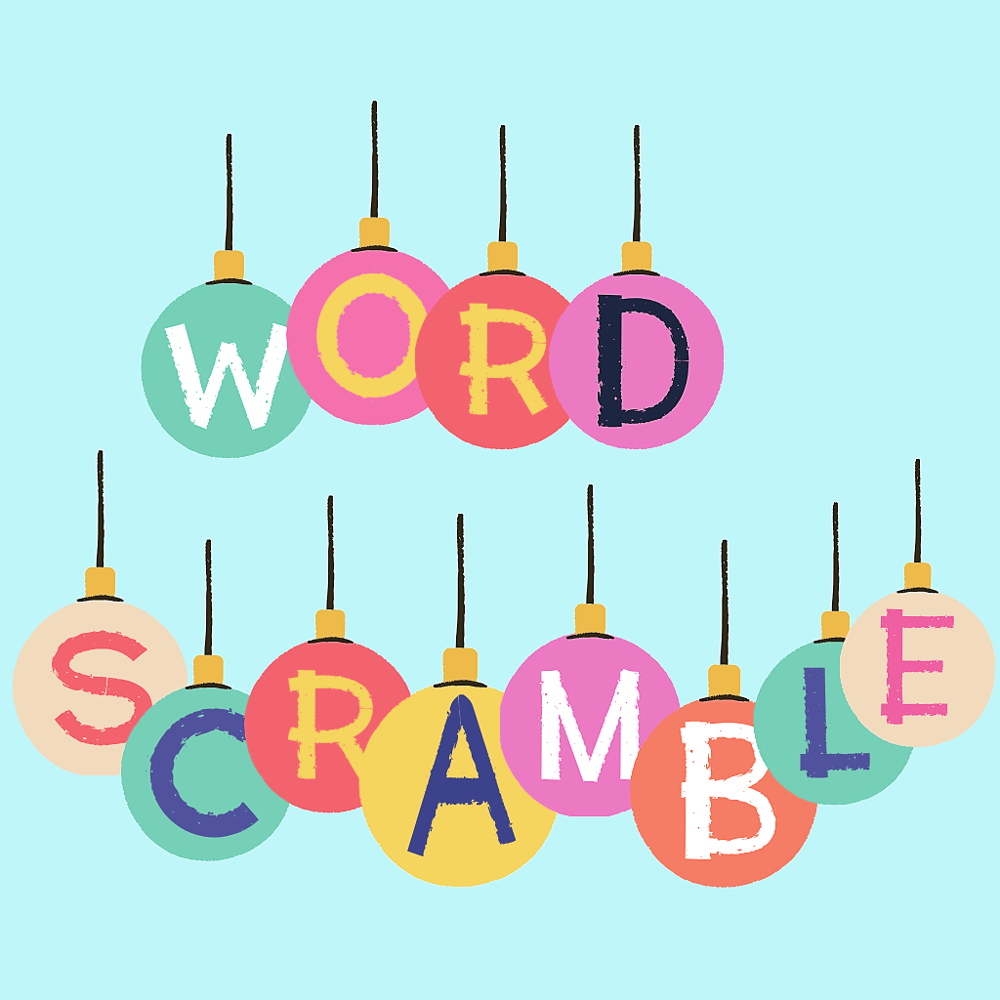

<h1> Word Scramble, Project 5 </h1>
<h2> Day 30 of 100 Days of SwiftUI </h2>

 In this project, I learned about 
<ol> 
<li> List </li> 
<li> UITextChecker </li> 
<li> Bundle </li> 
<li> Strings APIs </li> 
<li> FatalError() </li> 
</ol>

Screenshot of the app layout (left) and App Icon (right)  
 

