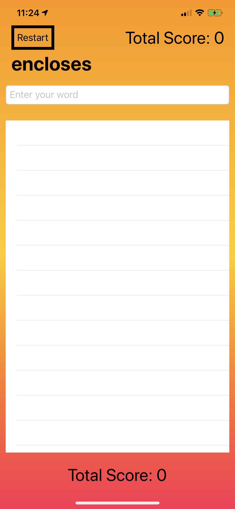

<h1> Word Scramble, Project 5 </h1>
<h2> Day 30 of 100 Days of SwiftUI </h2>

 In this project, I learned about 
<ol> 
<li> List </li> 
<li> UITextChecker </li> 
<li> Bundle </li> 
<li> Strings APIs </li> 
<li> FatalError() </li> 
</ol>

Screenshot of the app layout (left) and App Icon (right)  
 

<h2> Day 31 of 100 Days of SwiftUI </h2>

 
  Today is the Challenge Day. 
<ol> 
  <li> Disallow answers that are shorter than three letters or are just our start word </li> 
  <li> Add a left bar button item that calls startGame(), so users can restart with a new word whenever they want to </li> 
  <li> Put a text view below the List so you can track and show the player’s score for a given root word </li> 
</ol>
I added a textView to show the total score both at the bottom of the list and at the right corner of the NavBar.   

